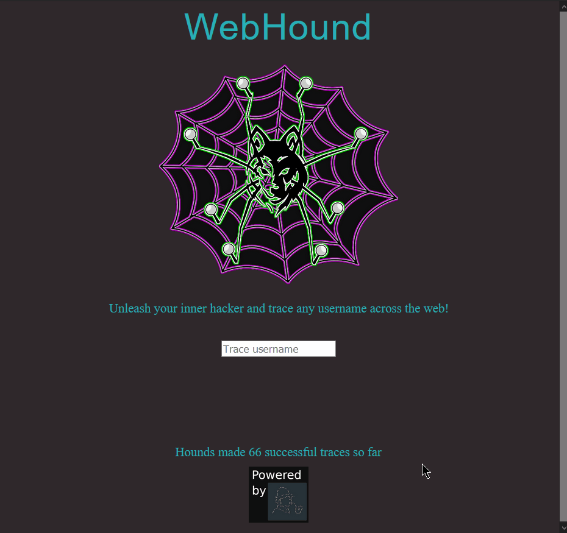

<p align=center>

  

  <br>
  <span>Trace any account across the web in this scalable web port of the <a target="_blank" href="https://github.com/sherlock-project/sherlock">Sherlock project</a></span>
  <br>


<p align="center">
  <a href="#demo">Demo</a>
  &nbsp;&nbsp;&nbsp;|&nbsp;&nbsp;&nbsp;
  <a href="#usage">Usage</a>
  &nbsp;&nbsp;&nbsp;|&nbsp;&nbsp;&nbsp;
  <a href="#installation">Installation</a>
  &nbsp;&nbsp;&nbsp;|&nbsp;&nbsp;&nbsp;
  <a href="#run">Run</a>
  &nbsp;&nbsp;&nbsp;|&nbsp;&nbsp;&nbsp;
  <a href="#code-quality">Code Quality</a>
</p>

<p align="center">
<a href="https://asciinema.org/a/223115">

</a>
</p>

## Demo

Use this link to test WebHound directly in your browser:
https://branimirs-page.herokuapp.com/webhound/trace/

## Usage
- Type in a username and press enter. The celery task will do the query for you async.
- The query page reloads every 10 seconds to update you when the results are done. This can be done manually too.
- If you close the query page, you can come back to it anytime or just type the same username in the search page.

## Installation
```bash
# clone the repo 
$ git clone git@github.com:beepy0/WebHound.git

# change to the project directory
$ cd WebHound

# install python3 and python3-pip if they are not installed

# install additional libraries
$ python -m pip install -r requirements.txt

# install RabbitMQ: https://www.rabbitmq.com/
```


## Run
- Start server: `python manage.py runserver`
- Start celery task: `celery -A WebHoundApp worker -l info`
- Navigate to `https://127.0.0.1:8000/webhound/trace/`

## Code Quality
- Test: `coverage run manage.py test WebHoundApp` then `coverage report`
- Run tests separately: `python manage.py test`
- Linter: `flake8 --statistics`

## Deploying on Heroku
The supplied Procfile is sufficient for <a href="https://devcenter.heroku.com/articles/git">deploying on Heroku</a>.

In order to have persistent storate (Heroku will reset sqlite3 data as containers are ephemeral), you need to change to another storage solution, for example Heroku's <a href="https://devcenter.heroku.com/articles/heroku-postgresql"> PostgreSQL add-on</a>.

You also need to change `app` in `celery.py` to use the <a href="https://stackoverflow.com/questions/57440254/heroku-app-cannot-connect-to-celery-worker"> Heroku add-on broker</a>

Last thing you need to configure is change the `root_url` in `config.py` to reflect your website's root url (localhost by default and for dev purposes)
